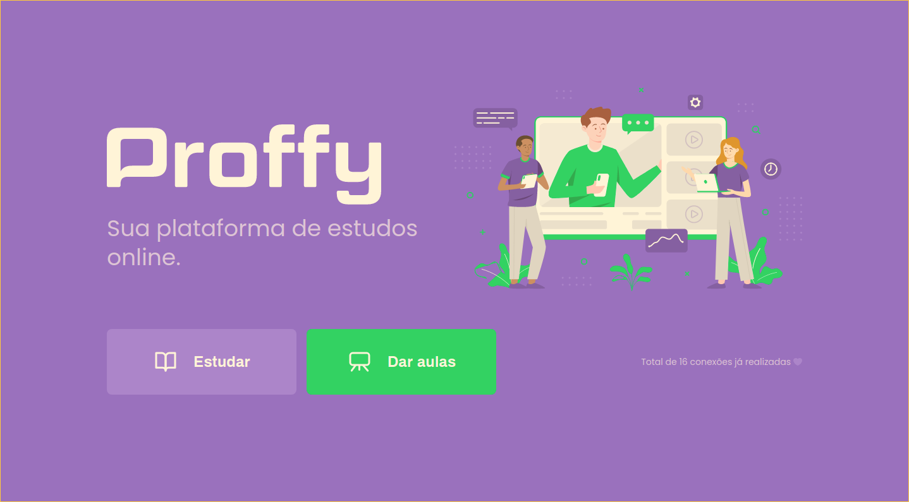
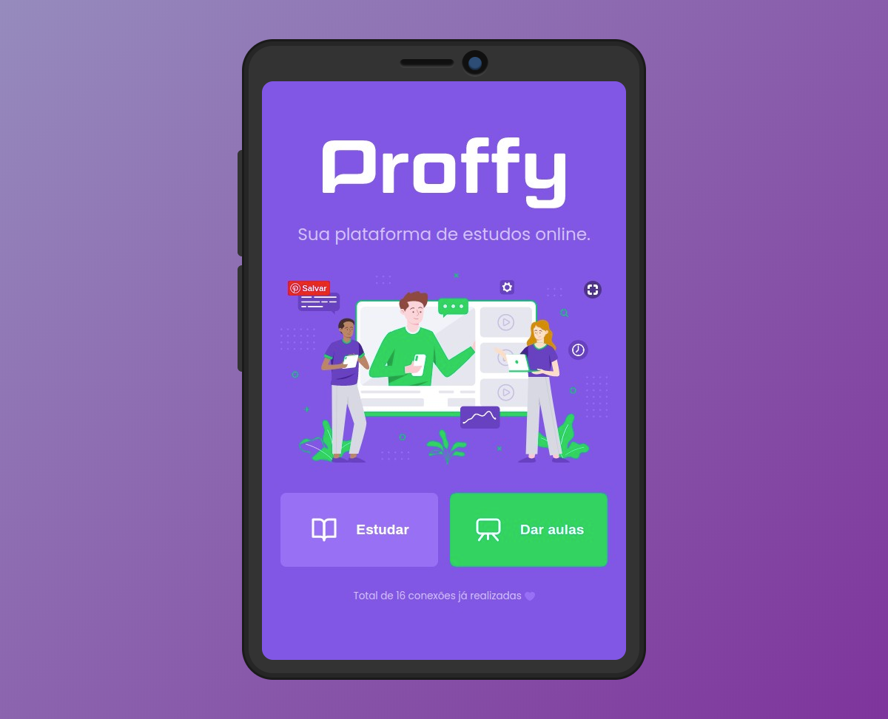
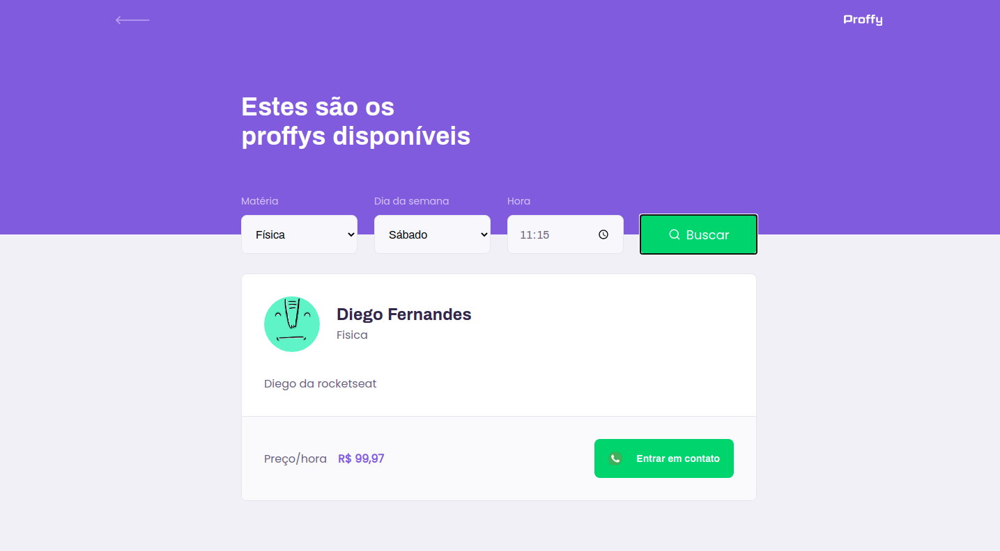
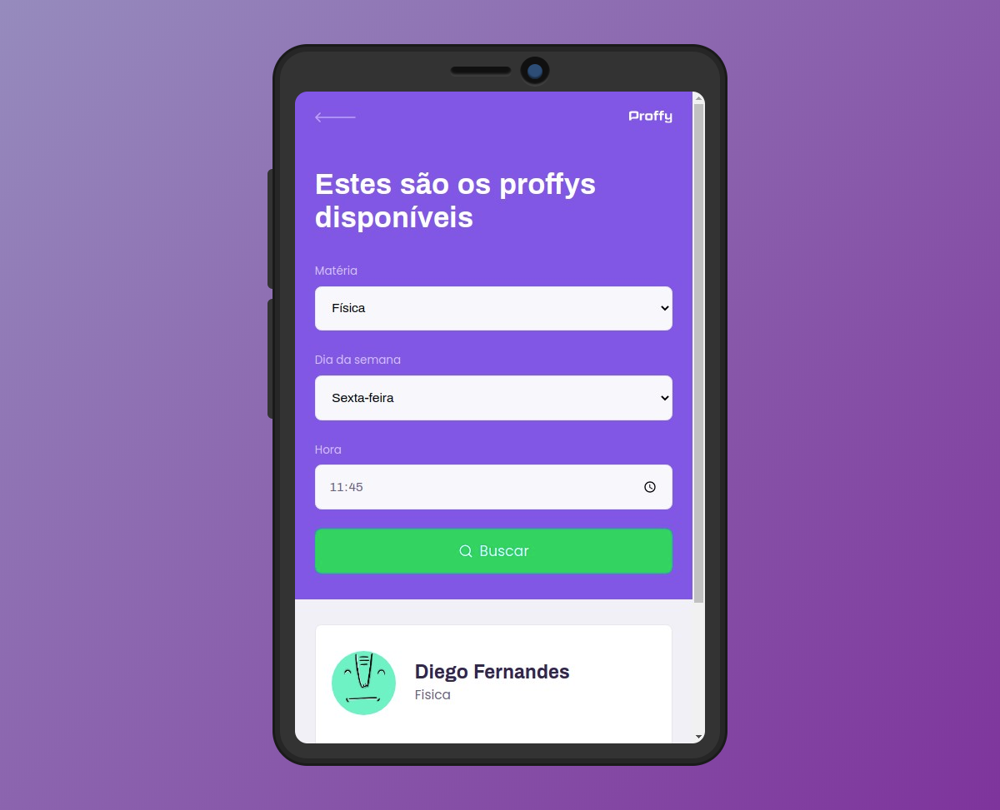
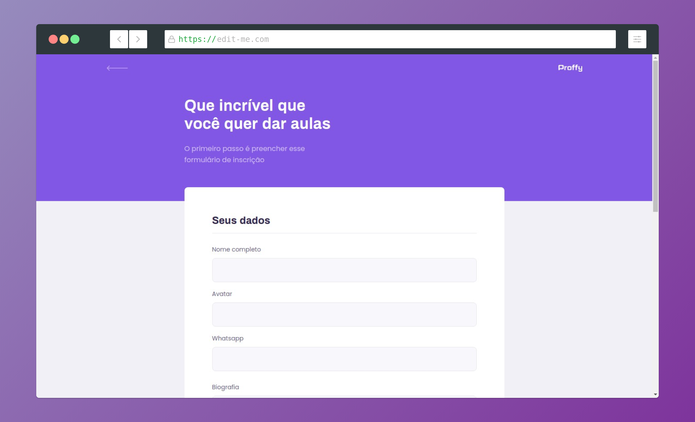
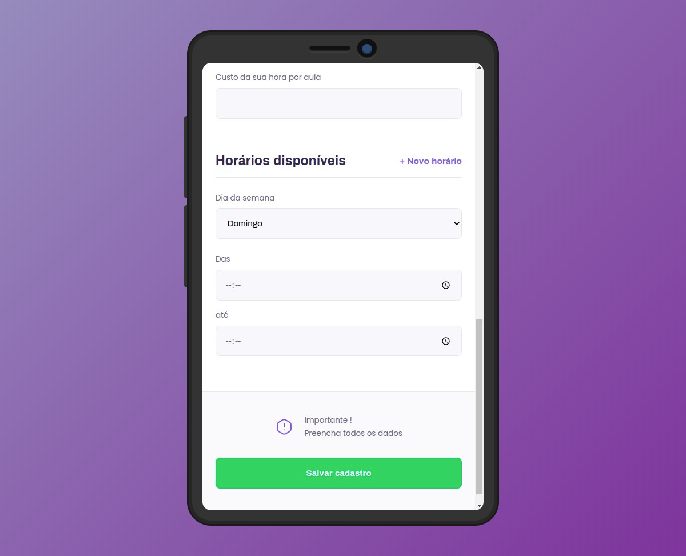
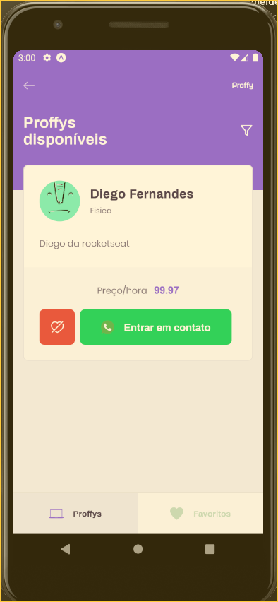
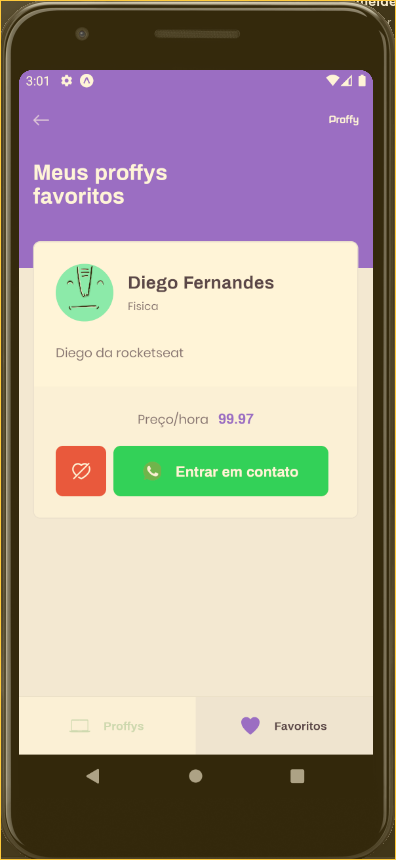

# Next Level Week \#2
---

# :pushpin: Table of Contents

* [Screens](#point_right-screens)
* [Features](#rocket-features)
* [Installation](#construction_worker-installation)
* [Getting Started](#runner-getting-started)
* [Found a bug? Missing a specific feature?](#bug-issues)
* [Contributing](#tada-contributing)
* [License](#closed_book-license)

# :point_right: Screens

<div>
  <p style="display: flex;">
    
    
  </p>


  <p style="display: flex;">
    
    
  </p>


  <p style="display: flex;">
    
    
  </p>

  <p style="display: flex; justify-content: space-between;">
    
    
    
  </p>
</div>

# :rocket: Features

## Backend Features

#### :electric_plug: Connections

- Route to list total of connections;
- Route to create new Connection;

#### :video_camera: Subjects

- Route to create subject lesson;
- Route to list lessons and proffys;
  - Filter by subject, week day and time;

#### : Proffy

- Route to create proffy profile and add subjecto to lesson;

## Frontend

### Pages

#### Landing Page

- Buttons
  - Study;
  - Give-Classes;

#### Study

- Filter by Subject, week day and time;
- Proffys list;
  - Button In touch (by Whatsapp);

#### Dar Aulas

- Sign up areas;
  - Sign up personal data;
  - Sign up lesson/classes;
  - Sign up work times to lesson;

# :construction_worker: Installation

**You need to install [Node.js](https://nodejs.org/en/download/), [Yarn](https://yarnpkg.com/), [Android SDK](https://medium.com/surabayadev/setting-up-react-native-android-without-android-studio-35a496e1dfa3), [Expo](https://docs.expo.io/get-started/installation/) first and then, in order to clone the project via HTTPS, run this command:**

```git clone https://github.com/jeanmolossi/next-level-week-2.git```

**Install dependencies**

```cd server && yarn install```

then

```cd ../web && yarn install```

then

```cd ../mobile && yarn install```

**Setup the API**

In **root** of project, run:

```cd server && yarn knex:migrate```

# :runner: Getting Started

Run the following command **on project root folder** in order to start the application in a development environment:

```
  // Run server API
  cd server && yarn start
```
In another terminal tab/window

```
  // Run web application
  cd web && yarn start
```
In another terminal tab/window

```
  // Run mobile application
  cd mobile && yarn start
```

# :bug: Issues

Feel free to **file a new issue** with a respective title and description on the the [Gympoint Mobile](https://github.com/jeanmolossi/next-level-week-2/issues) repository. If you already found a solution to your problem, **i would love to review your pull request**! Have a look at our [contribution guidelines](https://github.com/jeanmolossi/next-level-week-2/blob/master/CONTRIBUTING.md) to find out about the coding standards.

# :closed_book: License

Released in 2020.
This project is under the [MIT license](https://github.com/jeanmolossi/next-level-week-2/master/LICENSE).

Made by [Jean Molossi](https://github.com/jeanmolossi) 🚀